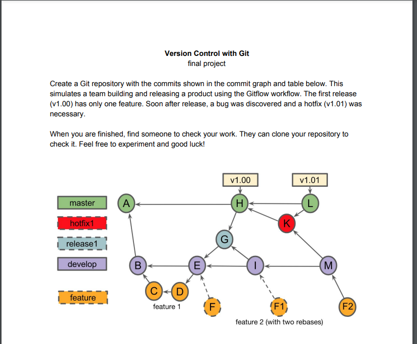

# Git Workflow

📌 **Objetivo**: praticar e documentar um fluxo de versionamento com **Git**, utilizando branches, merges, rebases e tags em um cenário colaborativo.

---

## 🔧 Ferramentas utilizadas
- Git  
- GitHub  
- Linha de comando (Git Bash)  

---

## 🚀 O que foi praticado
- Criação e navegação entre branches (`git branch`, `git checkout`)  
- Commits incrementais (`git add`, `git commit`)  
- Merge entre branches (`git merge`)  
- Rebase para reorganizar histórico (`git rebase`)  
- Criação e remoção de tags (`git tag`, `git tag -d`)  
- Resolução de conflitos  
- Push e pull para repositórios remotos (`git push`, `git pull`)  

---

## 📂 Estrutura do projeto
Este repositório contém:  
- `comandos.txt`: lista dos principais comandos utilizados.  
- `docs/final_project.png`: imagem ilustrando o fluxo de branches e commits do projeto final.  

---

## 📊 Fluxo do Projeto Final
O projeto seguiu o **Gitflow Workflow**, simulando um time que constrói e lança um produto.  
- A versão `v1.00` foi criada com uma primeira feature.  
- Logo após o lançamento, foi necessário aplicar um **hotfix**, resultando na versão `v1.01`.  
- Novas features foram desenvolvidas em paralelo utilizando **branches e rebases**.  

Abaixo está o grafo de commits do projeto final do curso *Version Control with Git* (Coursera), demonstrando o uso de branches, merges, rebases e hotfixes no fluxo Gitflow:

---

## 📌 Resultados
- Melhor compreensão sobre **fluxos de versionamento Git**.  
- Exercício prático de **branches, merges e rebases**.  
- Criação de um histórico organizado e documentado.  

---

💡 Este projeto faz parte do meu portfólio de aprendizado em **Git & GitHub**, com foco em boas práticas de versionamento para projetos de Data Science e desenvolvimento de software.

